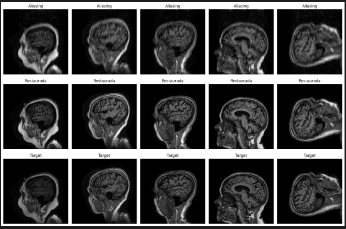
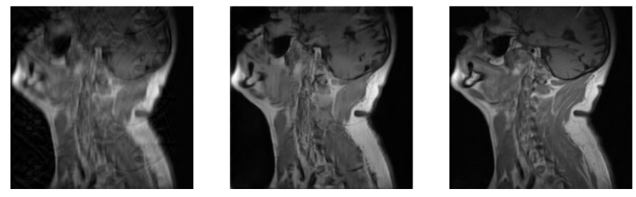
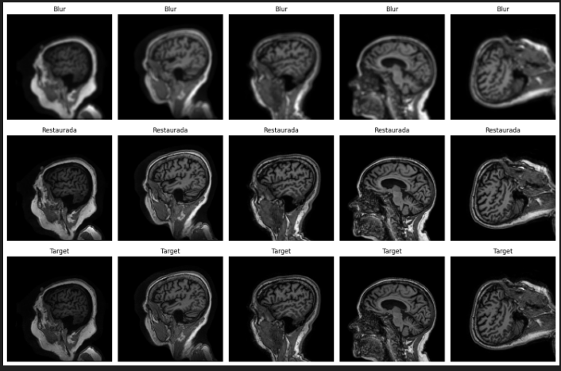
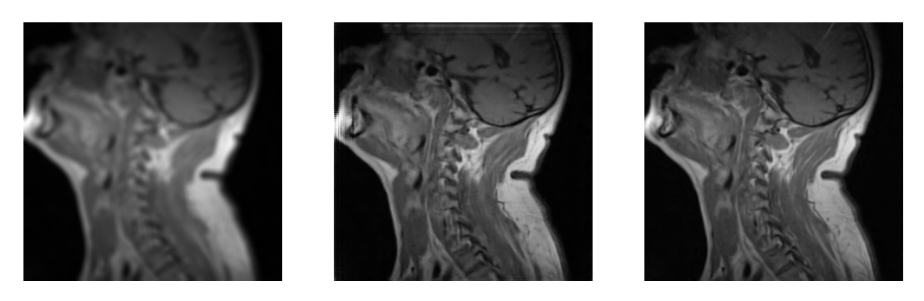

# Low-Field MRI Reconstruction

This repository contains code and resources for reconstructing magnetic resonance imaging (MRI) images acquired from low-field equipment. The main focus is improving image quality and facilitating analysis through various processing and evaluation techniques.

## Overview

This project implements advanced techniques for reconstructing magnetic resonance imaging (MRI) images acquired from low-field equipment. The main objective is to improve the quality of images that are typically blurry or low-resolution due to hardware limitations in such equipment.

## Key Features

### Image Processing
- **Wavelet Transform**: Uses wavelet transforms to decompose MRI images into approximation and detail components, allowing spatial information analysis and manipulation (files like `check.py` and `check2.py`).

### Automatic Reconstruction
- **Deep Neural Networks**: Implements deep neural network models (CNN, autoencoders, and hybrid models like WaCAEN) to restore MRI images from degraded versions, increasing sharpness and recovered visual information (`predict_new.py`, `predict_ssim.py`).

### Quantitative Evaluation
- **Quality Metrics**: Calculates metrics such as PSNR, SSIM, MS-SSIM, VIFP, MSE, RMSE, SCC, RASE, SAM to compare the quality of reconstructed images against target or reference images. Results can be saved in PDF files or Markdown tables for further analysis (`new_statistics.py`).

### Automation and Experimentation
- **Batch Processing**: Allows batch processing of images in specific folders, generates comparison reports, and facilitates experimentation by removing or modifying specific image components (horizontal, vertical, diagonal details).

## Key Components

- **Wavelet Transform**: Image decomposition and reconstruction to extract and modify spatial details
- **Deep Neural Networks**: Models trained to restore low-quality images
- **Standard Metrics Evaluation**: PSNR, SSIM, VIFP, among others
- **Automatic Report Generation**: PDF and CSV files to compare results and document experiments

## Results

### Aliasing Correction Results

*Validation results for aliasing correction using the WaCAEN model*

*Low-field MRI aliasing correction results*

### Blur Correction Results

*Validation results for blur correction using the WaCAEN model*

*Low-field MRI blur correction results*

## Application

This code is useful for researchers or professionals working with low-field medical images who seek to maximize diagnostic information through computational restoration techniques.

## Repository Structure

- `src/data-processing/`: Image processing and analysis tools
- `src/prediction/`: Model prediction and inference scripts
- `src/wacaen/`: WaCAEN model implementation and training
- `graphics/`: Result images and visualizations
- `thesis/`: Academic documentation

---

# Informe en Español

## Informe corto sobre el repositorio `low-field-MRI-reconstruction`

### Descripción general

Este proyecto implementa técnicas avanzadas para la reconstrucción de imágenes de resonancia magnética (MRI) adquiridas en equipos de bajo campo. El objetivo principal es mejorar la calidad de las imágenes que suelen ser borrosas o de baja resolución debido a las limitaciones de hardware en ese tipo de equipos.

### ¿Qué hace el proyecto según el código?

- **Procesamiento de imágenes:** Utiliza transformadas wavelet para descomponer imágenes MRI en componentes de aproximación y detalles, permitiendo el análisis y manipulación de la información espacial (archivos como `check.py` y `check2.py`).

- **Reconstrucción automática:** Implementa modelos de redes neuronales profundas (CNN, autoencoders y modelos híbridos como WaCAEN) para restaurar imágenes MRI a partir de versiones degradadas, incrementando la nitidez y la información visual recuperada (`predict_new.py`, `predict_ssim.py`).

- **Evaluación cuantitativa:** Calcula métricas como PSNR, SSIM, MS-SSIM, VIFP, MSE, RMSE, SCC, RASE, SAM para comparar la calidad de la imagen reconstruida frente a la imagen objetivo o referencia. Los resultados se pueden guardar en archivos PDF o tablas Markdown para análisis posterior (`new_statistics.py`).

- **Automatización y experimentación:** El proyecto permite el procesamiento por lotes de imágenes en carpetas específicas, genera informes de comparación y facilita la experimentación eliminando o modificando componentes específicos de la imagen (detalles horizontales, verticales, diagonales).

### Componentes clave

- **Transformada wavelet:** Descomposición y reconstrucción de imágenes para extraer y modificar detalles espaciales.
- **Redes neuronales profundas:** Modelos entrenados para restaurar imágenes de baja calidad.
- **Evaluación con métricas estándar:** PSNR, SSIM, VIFP, entre otros.
- **Generación de informes automáticos:** PDF y CSV para comparar resultados y documentar experimentos.

### Aplicación

Este código es útil para investigadores o profesionales que trabajan con imágenes médicas de bajo campo y buscan maximizar la información diagnóstica mediante técnicas de restauración computacional.